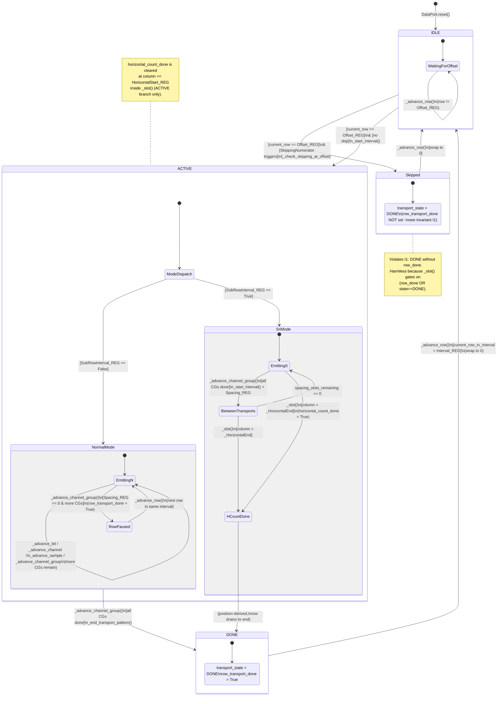
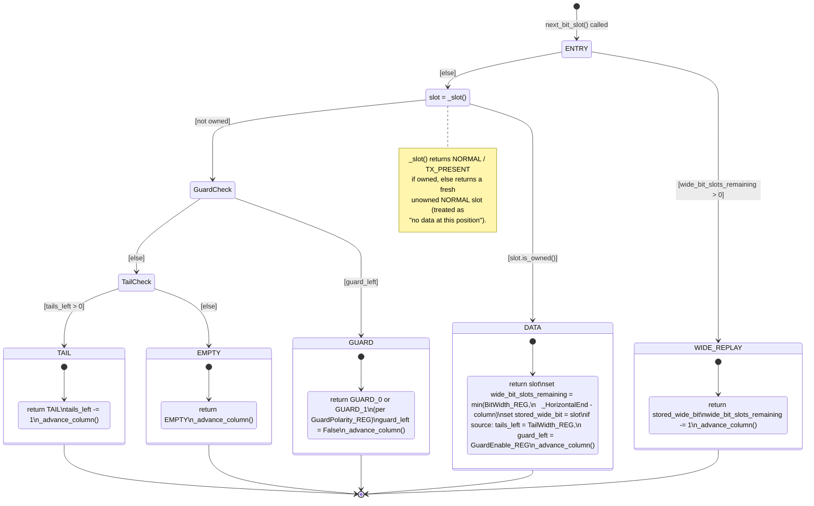
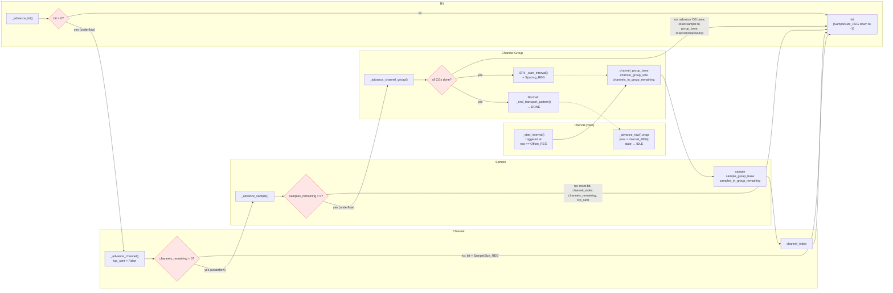
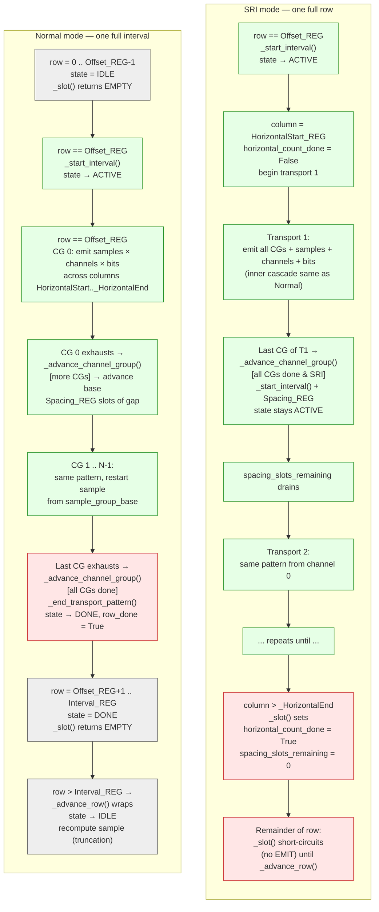

# DataPort FSM Review

A structural review of `src/models/dataport.py` focused on implicit state
machines, redundant state encodings, and un-asserted invariants.

Scope: `DataPortState` (fields), `DataPortAlgorithm` (transitions), and all
reset paths. Read-only review — no edits proposed here.

---

## 1. STATE INVENTORY

All fields are defined in `DataPortState.reset()` (dataport.py:118-156).

### Position
| Field | Type | Purpose |
|---|---|---|
| `column` | `int` | Current column within the row (0 .. num_columns-1) |
| `current_row_in_interval` | `int` | Row offset within the current interval (0 .. Interval_REG) |

### Lifecycle / status
| Field | Type | Purpose |
|---|---|---|
| `transport_state` | `TransportState` | IDLE / ACTIVE / DONE for the interval's transport pattern |
| `row_transport_done` | `bool` | No more data will be emitted on this row |
| `horizontal_count_done` | `bool` | Column has passed `_HorizontalEnd` for this transport window |

### Counter cascade (outer → inner)
| Field | Type | Purpose |
|---|---|---|
| `sample` | `int` | Current sample number (monotonically increasing across intervals) |
| `sample_group_base` | `int` | Sample number at start of current transport; channel groups restart from here |
| `samples_in_group_remaining` | `int` | Countdown within current sample group (underflows at -1) |
| `channel_group_base` | `int` | Index of first channel in current channel group |
| `channel_group_size` | `int` | Size of current channel group (derived from ChannelGrouping_REG) |
| `channels_in_group_remaining` | `int` | Countdown within current channel group (underflows at -1) |
| `channel_index` | `int` | Sequential index into `_enabled_channels` for current channel |
| `bit` | `int` | Countdown of bits remaining in current sample (SampleSize_REG down to -1) |
| `spacing_slots_remaining` | `int` | Countdown of idle slots between channel groups / SRI transports |

### One-shot flags
| Field | Type | Purpose |
|---|---|---|
| `txp_sent` | `bool` | TxPresent emitted for the current (sample, channel); blocks duplicate TxP |
| `guard_left` | `bool` | One guard bit is queued to emit after data (source ports only) |
| `tails_left` | `int` | N tail bits queued to emit after guard (degenerate "queue of length N") |

### Wide-bit replay
| Field | Type | Purpose |
|---|---|---|
| `wide_bit_slots_remaining` | `int` | How many more columns the stored slot should be replayed |
| `stored_wide_bit` | `Optional[BitSlotState]` | The slot being replayed across BitWidth_REG columns |

### Skipping
| Field | Type | Purpose |
|---|---|---|
| `skipping_accumulator` | `int` | Bresenham-style accumulator for fractional skipping (SkippingNumerator/Denominator) |

---

## 2. IMPLICIT STATE MACHINES

### (a) Transport lifecycle — 3 × 2 × 2 = 12 combinations

Axes: `transport_state ∈ {IDLE, ACTIVE, DONE}`,
`row_transport_done ∈ {F, T}`, `horizontal_count_done ∈ {F, T}`.

Legend: **R** reachable, **I** illegal-by-construction, **S** stale/only via
incomplete reset, **Redundant** = observationally equivalent to another row.

| # | transport_state | row_done | hcount_done | Status | Notes |
|---|---|---|---|---|---|
| 1 | IDLE | F | F | **R** | Initial state after `DataPortState.reset()`; between intervals before `Offset_REG` reached. |
| 2 | IDLE | F | T | **S** | `horizontal_count_done` is never cleared at interval wrap (only at column == HorizontalStart during ACTIVE). Can leak across intervals. |
| 3 | IDLE | T | F | **S** | `row_transport_done` is reset in `_advance_row` to False before the IDLE wrap, so this should not occur in practice. No code path sets this combination. |
| 4 | IDLE | T | T | **S** | Same as #3 compounded with #2. Not produced, but not prevented. |
| 5 | ACTIVE | F | F | **R** | Normal emitting state inside the horizontal window. |
| 6 | ACTIVE | F | T | **R** | `_slot()` sets `horizontal_count_done = True` and returns NORMAL (no data) once column > `_HorizontalEnd`. The port stays ACTIVE until interval wrap or SRI terminates it. **Observationally equivalent to row_done=True for `_slot()` purposes** — both short-circuit the same way. |
| 7 | ACTIVE | T | F | **R** | Produced by `_advance_channel_group` when `Spacing_REG == 0` (line 336). In SRI mode, the same call also resets `transport_state` back to ACTIVE via `_start_interval()`, so this state is paired with row_done=True but not DONE. |
| 8 | ACTIVE | T | T | **R** | Reachable: row_done set by #7 path, then column crosses `_HorizontalEnd`. But `_slot()` short-circuits on row_done before checking hcount_done, so hcount_done stops being updated — it's a stale latch in this cell. |
| 9 | DONE | F | F | **I** | Every DONE-setter sets row_done=True simultaneously in `_end_transport_pattern` (line 297-298). **But `_check_skipping_at_offset` (line 418) sets DONE without setting row_done** — see Section 3. So this row IS reachable via the skip path. |
| 10 | DONE | F | T | **S / Reachable** | Reachable via skip path (#9 mechanism) if hcount_done was stale from a prior row. |
| 11 | DONE | T | F | **R** | Normal termination via `_end_transport_pattern()` before column crosses `_HorizontalEnd`. |
| 12 | DONE | T | T | **R** | Same as #11, with subsequent column advance past `_HorizontalEnd` — but `_slot()` short-circuits on `row_done or state==DONE`, so hcount_done is never actually set in this path. Rows #11 and #12 are observationally indistinguishable. |

**Reachable & distinct:** 1, 5, 6, 7, 11.
**Reachable but redundant:** 6 ≈ 11 (both short-circuit in `_slot()`), 8 is 7 with a no-op latch, 12 ≈ 11.
**Violates stated invariant (Section 4, #1):** 9, 10 — produced by the skip path.

### (b) Per-slot output FSM inside `next_bit_slot()`

```
                       ┌──────────────┐
                  ┌────│ ENTRY        │
                  │    └──────────────┘
                  │         │
                  │         ▼
                  │    wide_slots>0 ?──yes──► WIDE_REPLAY ──► advance_column ──► return stored
                  │         │no
                  │         ▼
                  │    _slot() owns ?──yes──► DATA ─────► set wide=BitWidth
                  │         │no                           set guard_left=GuardEnable (src)
                  │         │                             set tails_left=TailWidth  (src)
                  │         ▼                             advance_column ──► return data
                  │    guard_left ?──yes──► GUARD ──► clear guard_left ──► advance ──► return G
                  │         │no
                  │         ▼
                  │    tails_left>0 ?──yes──► TAIL ──► decrement tails ──► advance ──► return T
                  │         │no
                  │         ▼
                  └──── EMPTY ──► advance_column ──► return EMPTY
```

Observations:
- Ordering is strictly: WIDE_REPLAY → DATA → GUARD → TAIL → EMPTY.
- Guard and tails are **source-only** — sink ports never set `guard_left` / `tails_left`.
- DATA sets wide/guard/tails in the same call; they fire on the NEXT calls only when `_slot()` stops returning owned slots.
- WIDE_REPLAY bypasses `_slot()` entirely — no counter cascade runs, no TxP check, no HorizontalEnd check. Counter advance happened on the DATA step that seeded the replay.
- Guards are always 1 column wide regardless of `BitWidth_REG` (comment at line 591).

### (c) Counter cascade FSM

Nested countdown with underflow-triggered parent advance:

```
  _advance_bit()
    bit -= 1
    bit < 0 ? ──► _advance_channel()
                    channel_index += 1
                    channels_in_group_remaining -= 1
                    txp_sent = False
                    channels_in_group_remaining < 0 ? ──► _advance_sample()
                                                            sample += 1
                                                            samples_in_group_remaining -= 1
                                                            samples_in_group_remaining < 0 ? ──► _advance_channel_group()
                                                                                                   (branches: see 2d)
                                                            else: reset bit, channel_index=base,
                                                                  channels_remaining=size-1, txp_sent=F
                    else: reset bit=SampleSize_REG
```

Invariant shape: each level's "remaining" counter goes from `size-1` down to `-1`, at which point it's reset and the parent advances by 1.

### (d) Normal vs SRI termination in `_advance_channel_group`

```
_advance_channel_group():
  │
  ▼
  channel_group_base + channel_group_size >= _NumChannels ?
  │
  ├── YES (all groups done):
  │     SubRowInterval_REG ?
  │     ├── NO  (Normal): _end_transport_pattern()
  │     │                 ├─ transport_state = DONE
  │     │                 └─ row_transport_done = True
  │     │
  │     └── YES (SRI):    _start_interval()      # transport_state = ACTIVE
  │                       spacing_slots_remaining = Spacing_REG
  │                       # termination is position-based: _slot() sets
  │                       # horizontal_count_done when column > _HorizontalEnd
  │
  └── NO (more groups):
        channel_group_base += channel_group_size
        channels_in_group_remaining = min(remaining, group_size) - 1
        samples_in_group_remaining = SampleGrouping_REG
        if ChannelGrouping_REG > 0 and < _NumChannels:
            sample = sample_group_base          # restart samples for new CG
        bit = SampleSize_REG
        channel_index = channel_group_base
        spacing_slots_remaining = Spacing_REG
        txp_sent = False

  [falls through, regardless of branch taken above]

  Spacing_REG == 0 ?
  ├── YES: row_transport_done = True
  └── NO : spacing_slots_remaining -= 1
```

**Note the fall-through spacing handling.** Even on the Normal-mode terminal
branch, the `Spacing_REG == 0` check re-executes and would set
`row_transport_done = True` — but it's already True from `_end_transport_pattern`,
so no observable effect. In the SRI branch, `Spacing_REG == 0` sets
`row_transport_done = True` even though `_start_interval` just set
`transport_state = ACTIVE`. Effectively: **SRI mode requires Spacing_REG > 0
to emit more than one transport per row**; Spacing=0 degenerates to a single
transport per row.

---

## 3. STATE SMELLS

### S1. `row_transport_done` vs `transport_state == DONE`

- `_end_transport_pattern()` sets BOTH together — this is the documented
  contract at line 291-298.
- `_check_skipping_at_offset()` at line 418 sets `transport_state = DONE`
  **without** setting `row_transport_done`. This was a deliberate shortcut
  (the caller `_advance_row` returns immediately, and `row_transport_done`
  was just reset to False a few lines above). But it breaks the stated
  invariant.
- `row_transport_done` CAN be True while `transport_state == ACTIVE` —
  specifically when `_advance_channel_group` with `Spacing_REG == 0`
  terminates the row early (Normal mode) or, in SRI mode, degenerates
  to one transport per row.
- `_slot()` always checks both as an `or`, so the two fields are
  **functionally redundant for gating emission** but **semantically different**:
  DONE = "no more data this interval", row_done = "no more data this row".
- **Recommendation flag:** these two fields encode 3 distinct logical states
  (row-done-but-interval-alive, interval-done, neither), and one invalid one
  (interval-done-but-row-alive). A cleaner model is a single enum
  `{EMITTING, ROW_DONE, INTERVAL_DONE}` plus a computed
  `is_emitting_this_row` predicate.

### S2. `horizontal_count_done` — latch or predicate?

- Set True at line 488 when `column > _HorizontalEnd` (in ACTIVE branch).
- Reset False at line 481 when `column == HorizontalStart_REG` (in ACTIVE branch).
- Read as a short-circuit at line 484.
- **This is purely a function of `column`, `HorizontalStart_REG`, and
  `_HorizontalEnd`.** It could be a `@property`:

  ```python
  @property
  def horizontal_count_done(self) -> bool:
      return self.column > self._HorizontalEnd
  ```

- The reset-at-HorizontalStart matters only because `column > _HorizontalEnd`
  on the NEXT row could still be true before column is reset — but
  `_advance_row` sets `column = 0`, so the predicate naturally becomes False.
  The explicit reset at line 481 appears to be vestigial.
- **Flag as: field that duplicates position-derivable state. Can be deleted
  and replaced with a property.** The only nuance is that `_slot()` also sets
  `spacing_slots_remaining = 0` when it first notices `column > _HorizontalEnd`
  (line 489) — that side-effect must be relocated if the field is removed.

### S3. `txp_sent` + `bit == SampleSize_REG` as paired guard

- Line 497-499 guards TxP emission with BOTH:
  - `FlowMode in (TX_CONTROLLED, ASYNC)`
  - `not txp_sent`
  - `bit == SampleSize_REG` (i.e., "first bit of a new sample")
- `txp_sent` is reset to False in `_start_interval`, `_advance_channel`,
  `_advance_sample`, `_advance_channel_group` — i.e., at every level of counter
  advance. So `txp_sent == False` already implies "first bit of a new (sample,
  channel)".
- The `bit == SampleSize_REG` check is belt-and-suspenders: it re-establishes
  the invariant after the one code path where `bit` is decremented without
  resetting txp_sent — which is `_advance_bit` itself. So the check is
  non-redundant **only** because txp_sent is set to True inside `_slot()` at
  line 509 but `bit` isn't decremented on that same call (TxP doesn't consume
  a data bit).
- **txp_sent is effectively a sub-state of the bit FSM within a (sample,
  channel)**: it's the "TxP emitted?" bit that distinguishes
  `(bit==SampleSize, txp_sent=F)` (emit TxP next) from
  `(bit==SampleSize, txp_sent=T)` (emit data bit next).
- Cleaner modeling: make the inner loop a 3-state mini-FSM per (sample,
  channel) when flow mode needs TxP: `NEED_TXP → EMITTING_DATA → DONE`.

### S4. `wide_bit_slots_remaining` + `stored_wide_bit` — two fields for one Optional state

- The RuntimeError at line 551 is the giveaway: the type system thinks
  `stored_wide_bit: Optional[BitSlotState]` is independent of
  `wide_bit_slots_remaining: int`, but the invariant is:
  ```
  wide_bit_slots_remaining > 0  ⇔  stored_wide_bit is not None
  ```
- Both fields are set together at lines 568-573 and reset together at
  line 427-428. They are never independently meaningful.
- **Refactor target:** collapse to one field:
  ```python
  wide_bit_replay: Optional[tuple[int, BitSlotState]] = None
  # or a @dataclass WideBitReplay(remaining: int, slot: BitSlotState)
  ```
- This eliminates the RuntimeError and the `assert` dance — the type checker
  enforces the invariant.

### S5. `guard_left: bool` + `tails_left: int` as a mini emission queue

- Emission order is fixed: GUARD (0 or 1) → TAIL (0..N).
- Current encoding uses two scalar counters. Equivalent models:
  - `pending_emissions: list[SlotType]` — most explicit, allocates per data slot.
  - `guard_pending: bool` + `tails_pending: int` — current approach, cheap.
  - Single `int` encoding `guard_flag_in_high_bit + tail_count` — obscure.
- The current approach is fine operationally but **obscures the fact that
  GUARD + TAILs are a FIFO emission pipeline**. If a future change needs to
  add HANDOVER or another post-data artifact, a real queue becomes worth it.
- **Flag as:** acceptable but non-obvious. Worth a comment at the state decl
  saying "these fields represent the post-data emission pipeline".

### S6. Reset paths — overlapping and inconsistent subsets

Five places reset state. Here is which fields each one touches:

| Field | `DataPortState.reset` | `DataPort.reset` | `reset_algorithm` | `_start_interval` | `_advance_row` |
|---|:-:|:-:|:-:|:-:|:-:|
| column | ✓ → 0 | (via state) | | | ✓ → 0 |
| current_row_in_interval | ✓ → 0 | (via state) | | | ✓ += 1, wrap to 0 |
| transport_state | ✓ → IDLE | (via state) | | ✓ → ACTIVE | ✓ → IDLE (on wrap) |
| row_transport_done | ✓ → F | (via state) | ✓ → F | | ✓ → F |
| horizontal_count_done | ✓ → F | (via state) | | | |
| tails_left | ✓ → 0 | (via state) | | | ✓ → 0 |
| guard_left | ✓ → F | (via state) | | | ✓ → F |
| skipping_accumulator | ✓ → 0 | (via state) | | | |
| sample | ✓ → 0 | (via state) | | | ✓ conditional recompute |
| sample_group_base | ✓ → 0 | (via state) | | ✓ ← current sample | |
| samples_in_group_remaining | ✓ → 0 | (via state) | | ✓ ← SampleGrouping | |
| channel_index | ✓ → 0 | (via state) | | ✓ → 0 | |
| spacing_slots_remaining | ✓ → 0 | (via state) | | ✓ → 0 | |
| channel_group_base | ✓ → 0 | (via state) | | ✓ → 0 | |
| channels_in_group_remaining | ✓ → 0 | (via state) | | ✓ ← size-1 | |
| channel_group_size | ✓ → 0 | (via state) | | ✓ ← derived | |
| bit | ✓ → 0 | (via state) | | ✓ ← SampleSize | |
| txp_sent | ✓ → F | (via state) | | ✓ → F | |
| wide_bit_slots_remaining | ✓ → 0 | (via state) | | | ✓ → 0 |
| stored_wide_bit | ✓ → None | (via state) | | | ✓ → None |

Inconsistencies:

- **`horizontal_count_done` is never reset by `_advance_row` or
  `_start_interval`.** Its only non-constructor reset is at line 481 inside
  `_slot()` when `column == HorizontalStart_REG`. This relies on `_slot()`
  being called on that exact column — if the column is skipped (e.g., due to
  a guard/tail emission ordering bug), the flag could stay True from a prior
  row. Low-probability but fragile.
- **`skipping_accumulator` is never reset by `_advance_row`.** Correct by
  design (accumulator must persist across intervals to drive skipping) —
  but worth documenting.
- **`_advance_row` resets `row_transport_done` unconditionally to False at line
  430**, BEFORE the skip check at line 455. If `_check_skipping_at_offset`
  sets `transport_state = DONE` (line 418), `row_transport_done` stays False.
  This is the invariant-violation case from Section 2a #9/10 and Section 3 S1.
- **`reset_algorithm` is a narrow reset.** It only resets `row_transport_done`
  and conditionally calls `_start_interval` — it does NOT reset position or
  counters. This is invoked from `DataPort.reset` AFTER `_state.reset()`, so
  it assumes a clean slate. Calling `reset_algorithm` outside that sequence
  would leave state partially stale.
- **`_start_interval` does not reset `column`, `current_row_in_interval`,
  `row_transport_done`, `horizontal_count_done`, `tails_left`, `guard_left`,
  `wide_bit_slots_remaining`, `stored_wide_bit`, or `skipping_accumulator`.**
  This is intentional (these are row-scoped or frame-scoped, not
  interval-scoped) but the boundary is non-obvious without a comment.

---

## 4. INVARIANTS (currently implicit — not asserted)

### I1. `transport_state == DONE` ⇒ `row_transport_done == True`

- **Documented** at module docstring (implied) and at `_end_transport_pattern`
  (line 291-298).
- **Holds** on the `_end_transport_pattern()` path.
- **Violated** on the `_check_skipping_at_offset()` path (line 418 sets DONE
  without touching row_transport_done; row_transport_done was set False at
  line 430 a few lines earlier).
- Downstream code does not care (both `_slot()` and `next_bit_slot()` gate on
  the `or` of both), but an `assert transport_state != DONE or row_transport_done`
  after every mutation would flag the skip-path gap.

### I2. `wide_bit_slots_remaining == 0` ⇔ `stored_wide_bit is None`

- Enforced by a runtime check in the forward direction only (line 550-551
  raises if slots > 0 and stored is None).
- The reverse direction (stored is not None ⇒ slots > 0) is not checked;
  a stale `stored_wide_bit` with slots==0 would be silently ignored.
- Paired resets at lines 427-428 (`_advance_row`) and paired sets at lines
  571-573 preserve the invariant in practice.
- A `@property` or a combined `Optional[WideBitReplay]` type would make this
  invariant structural rather than behavioral (see S4).

### I3. When `transport_state == ACTIVE`: `0 <= channel_index < _NumChannels`

- `channel_index` is set to 0 in `_start_interval` (line 390).
- Incremented in `_advance_channel` (line 357), which then checks
  `channels_in_group_remaining < 0` and recurses to `_advance_sample` /
  `_advance_channel_group`, which reset `channel_index` to `channel_group_base`.
- Between the `channel_index += 1` and the reset, `channel_index` can
  transiently equal `channel_group_base + channel_group_size`, which may
  equal `_NumChannels`. But `_config._channel(channel_index)` (line 247-256)
  raises `IndexError` if this is read before the reset — i.e., the invariant
  is **enforced at read time, not at write time**.
- Holds in normal flow because the cascade resets happen before the next
  `_slot()` call.

### I4. `channels_in_group_remaining >= -1` always

- Decremented once per `_advance_channel` call. When it reaches `-1`,
  `_advance_sample` is called, which resets it to `channel_group_size - 1`
  (line 352) or cascades further into `_advance_channel_group` which resets
  it to `remaining_channels - 1` (line 319).
- So `-1` is a transient value during the mid-cascade step. It never
  decreases below `-1` in normal flow.
- Same pattern for `samples_in_group_remaining`.
- An `assert self.channels_in_group_remaining >= -1` after each mutation
  would catch regressions.

### I5. Additional implicit invariants worth asserting

| Invariant | Where it could break |
|---|---|
| `sample_group_base <= sample` | `_advance_row` recompute at line 452 (`sample = sample_group_base + expected_samples_per_interval`) sets them unequal intentionally; other code assumes ≤. |
| `spacing_slots_remaining >= 0` | Decremented in `_advance_channel_group` (line 338) and `_slot()` (line 493); no lower bound check. |
| `channel_group_size > 0` when `transport_state == ACTIVE` | Depends on `_NumChannels > 0` at `_start_interval`; `_slot()` explicitly guards against `_NumChannels == 0` at line 476. |
| `current_row_in_interval <= Interval_REG` (after wrap) | Guaranteed by `_advance_row` wrap at line 435; worth asserting once. |
| `Offset_REG <= Interval_REG` | Config-level invariant, not checked here — if violated, `_start_interval` is never called and the port silently emits nothing. |
| `bit` in range `[-1, SampleSize_REG]` | `-1` is transient before `_advance_channel`; no assertion. |

---

## Summary of actionable smells (no changes made)

| # | Smell | Impact | Effort |
|---|---|---|---|
| 1 | `_check_skipping_at_offset` violates I1 (DONE without row_done) | Invariant gap; currently harmless | Low — add one assignment |
| 2 | `horizontal_count_done` is position-derivable | Field could be deleted, replaced with `@property` | Low |
| 3 | `(wide_bit_slots_remaining, stored_wide_bit)` encode one Optional | RuntimeError exists instead of type safety | Medium — touches several sites |
| 4 | `row_transport_done` and `transport_state == DONE` encode overlapping states | 3 logical states + 1 invalid squeezed into 2 fields | Medium |
| 5 | `txp_sent` is a sub-state of the per-channel bit FSM | Implicit coupling with `bit == SampleSize_REG` guard | Medium |
| 6 | Reset paths overlap inconsistently; `horizontal_count_done` and `skipping_accumulator` are reset in surprising places | Fragile across refactors | Low — documentation + table in code |
| 7 | `guard_left` + `tails_left` work as a 2-stage emission queue | Non-obvious but efficient | None needed unless pipeline grows |

---

## 5. MERMAID DIAGRAMS

### 5.1 Transport lifecycle (Normal vs SRI composite states)



### 5.2 Per-slot emission FSM inside `next_bit_slot()`



### 5.3 Counter cascade (underflow advances outer counter)



### 5.4 One interval in Normal mode vs one row in SRI mode



**Reading the contrast:**
- **Normal mode:** one transport spans many rows (whole interval). Termination
  is counter-driven (`all CGs done`). `state = DONE` holds from CG-exhaust
  through interval-wrap.
- **SRI mode:** many transports fit within one row. Termination is
  position-driven (`column > _HorizontalEnd`). `state` stays `ACTIVE` the whole
  row; `horizontal_count_done` is the gate, not `transport_state`.
- The same `_advance_channel_group()` method handles both — the branch at
  dataport.py:304 is the only mode-specific logic in the counter cascade.
